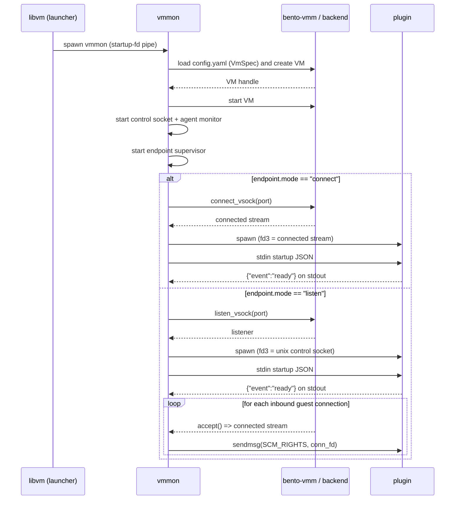

# 5. Vmmon Endpoint Plugins for Vsock Streams

Date: 2026-04-12

## Status

Proposed

## Context

`vmmon` already owns per-VM runtime supervision. It reads `config.yaml`, starts the VM, exposes the monitor control surface, and tracks VM and guest readiness.

Today, host to guest stream integrations are implemented as built-ins. `vmmon` already connects to guest vsock ports for things like the guest agent and shell access. That works for a small fixed set of features, but it does not scale well for arbitrary host to guest services. Every new service would require more built-in `vmmon` logic, more coupling to backend details, and more monitor-specific code for behavior that does not belong in the core VM supervisor.

Bentobox needs a generic way for `vmmon` to launch long-running helpers that can consume host to guest byte streams without `vmmon` relaying data in userspace.

This ADR defines that mechanism as endpoint plugins.

The first implementation target is macOS Virtualization.framework. The plugin contract must remain backend-agnostic so the same plugin API can later be used by other backends.

## Decision

Bentobox will add declarative `endpoints` to `VmSpec` and `vmmon` will supervise endpoint plugins for them.

Each configured endpoint binds together:

- a stable endpoint name,
- a vsock port,
- a runtime mode,
- a plugin command,
- lifecycle policy.

### Config model

The top-level `VmSpec` field is named `endpoints`.

Each endpoint uses a config enum named `EndpointMode` with these values:

- `connect`, meaning the host initiates a connection to a guest vsock port,
- `listen`, meaning the host accepts guest-initiated connections for a host vsock port.

The configured unit is called an endpoint throughout the spec, config, runtime state, and monitor reporting.

### Naming

The configured unit is a communication point defined by a port, a direction of initiation, and a plugin.

Candidate names considered:

| Name         | Pros                                                                    | Cons                                                            | Recommended |
| ------------ | ----------------------------------------------------------------------- | --------------------------------------------------------------- | ----------- |
| **endpoint** | Neutral, fits both connect and listen, matches runtime status reporting | Slightly generic                                                | **Yes**     |
| binding      | Conveys association between port and handler                            | Sounds like an OS bind operation, which does not fit `connect`  | No          |
| attachment   | Suggests a pluggable relationship                                       | Sounds like a lifecycle action rather than a config object      | No          |
| service      | User-facing and familiar                                                | Too semantic, implies higher-level protocol behavior            | No          |
| socket       | Technically related                                                     | Too low-level and ambiguous between listener, stream, and control socket | No          |

Decision: use `endpoint` in config, runtime state, plugin protocol, and monitor reporting.

### Plugin contract

Plugins are external processes launched by `vmmon`.

The plugin interface is intentionally small:

- `stdin`: exactly one startup JSON object, newline terminated,
- `stdout`: newline-delimited JSON events only,
- `stderr`: freeform logs,
- `fd 3`: the endpoint stream or endpoint control socket, depending on mode.

Plugins must not need to know which VM backend is in use.

### Data plane

All stream file descriptors handed to plugins represent connected, full-duplex, reliable byte streams. Plugins must treat them as generic nonblocking stream fds, not as TCP sockets or Unix sockets.

For `connect` mode:

- `vmmon` opens a connected vsock stream to the guest port,
- `vmmon` passes that connected stream to the plugin as `fd 3`.

For `listen` mode:

- `vmmon` creates a Unix `socketpair`,
- `vmmon` passes one end of that control socket to the plugin as `fd 3`,
- `vmmon` accepts guest-initiated vsock connections,
- `vmmon` passes each accepted connected stream to the plugin over the control socket using `SCM_RIGHTS`.

This keeps `vmmon` out of the data path while allowing one long-running plugin process to handle multiple guest connections.

### Diagrams

#### Boot and endpoint startup sequence



#### Listen accept and retry flow

```mermaid
flowchart TD
  A[Start listen endpoint] --> B{listen_vsock ok?}
  B -- no --> Z[Fatal: mark endpoint failed]
  B -- yes --> C[Spawn plugin with fd3 control socket]
  C --> D{Plugin ready before timeout?}
  D -- no --> E[Kill plugin and apply restart policy]
  D -- yes --> F[Accept loop]
  F --> G{accept() yields conn?}
  G -- error transient --> H[Log and retry with backoff]
  G -- error fatal --> I[Stop endpoint and apply restart policy]
  G -- conn --> J[sendmsg SCM_RIGHTS conn_fd plus conn_id payload]
  J --> K{send ok?}
  K -- yes --> F
  K -- ETOOMANYREFS or limits --> L[Backpressure and retry with backoff]
  K -- other error --> I
```

### Runtime reporting

`InspectResponse.endpoints` reports runtime endpoint health only. It does not expose the full configured endpoint specification.

Endpoint status is summarized by the plugin protocol and projected into monitor state.

Endpoint runtime status does not change the existing meaning of instance readiness:

- `PingResponse.ok` remains driven by VM and guest readiness,
- `InspectResponse.ready` remains driven by VM and guest readiness.

Endpoint failures are visible through endpoint status, not by redefining overall instance readiness.

### Protocol ownership

The runtime reporting contract in `bento-protocol` becomes the source of truth for endpoint status returned by `InspectResponse`.

The protocol enum `EndpointKind` is used for runtime reporting. It is distinct from config-time `EndpointMode`.

For this ADR, `EndpointKind` is defined in terms of endpoint runtime type:

- `ENDPOINT_KIND_VSOCK_CONNECT`
- `ENDPOINT_KIND_VSOCK_LISTEN`

### Scope of first implementation

The first implementation is macOS-first and relies on the existing Virtualization.framework vsock support already surfaced through `bento-vmm`.

This ADR does not require the first implementation to add missing Linux `listen_vsock` support for Firecracker or Cloud Hypervisor. Those can adopt the same plugin contract later.

## Consequences

### Positive

- `vmmon` stays generic and does not need service-specific built-ins for every new host to guest integration.
- Plugins can be written against one small API with no backend-specific logic.
- `vmmon` avoids becoming a per-byte relay in the hot data path.
- One plugin process can serve multiple guest-initiated connections in `listen` mode.
- Endpoint health becomes visible in monitor status without overloading guest-service readiness.

### Negative

- `vmmon` gains process supervision logic for plugins.
- `vmmon` must own fd hygiene, child process setup, restart policy, and stdout protocol parsing.
- `bento-protocol` must change to reflect the actual endpoint runtime model instead of carrying stale endpoint fields.
- Plugins must correctly handle raw nonblocking stream fds.

### Constraints

- The plugin API must stay backend-agnostic.
- Endpoint runtime health must stay separate from instance readiness.
- The first implementation must work on macOS without depending on unfinished Linux listener plumbing.

## Appendix A: Config Schema

This ADR extends `VmSpec` with an optional top-level `endpoints` field.

```yaml
endpoints:
  - name: string
    port: 1..4294967295
    mode: connect|listen
    plugin:
      command: string
      args: [string]
      env: { KEY: string }
      working_dir: string
    lifecycle:
      autostart: bool
      startup_timeout_ms: int
      restart: never|on-failure|always
      backoff_ms:
        initial: int
        max: int
```

### Semantics

- `name` is the stable identifier used in logs, startup JSON, and runtime status.
- `port` is the vsock port associated with the endpoint.
- `mode` defines whether `vmmon` connects or listens.
- `plugin` describes the executable launched by `vmmon`.
- `lifecycle` controls startup timeout and restart behavior.

### Rust shape

```rust
use serde::{Deserialize, Serialize};
use std::collections::BTreeMap;
use std::path::PathBuf;

#[derive(Debug, Clone, Serialize, Deserialize)]
pub struct EndpointSpec {
    pub name: String,
    pub port: u32,
    pub mode: EndpointMode,
    pub plugin: PluginSpec,
    #[serde(default)]
    pub lifecycle: LifecycleSpec,
}

#[derive(Debug, Clone, Copy, Serialize, Deserialize)]
#[serde(rename_all = "snake_case")]
pub enum EndpointMode {
    Connect,
    Listen,
}

#[derive(Debug, Clone, Serialize, Deserialize)]
pub struct PluginSpec {
    pub command: PathBuf,
    #[serde(default)]
    pub args: Vec<String>,
    #[serde(default)]
    pub env: BTreeMap<String, String>,
    #[serde(default)]
    pub working_dir: Option<PathBuf>,
}

#[derive(Debug, Clone, Serialize, Deserialize)]
pub struct LifecycleSpec {
    #[serde(default = "default_true")]
    pub autostart: bool,
    #[serde(default = "default_startup_timeout_ms")]
    pub startup_timeout_ms: u64,
    #[serde(default)]
    pub restart: RestartPolicy,
    #[serde(default)]
    pub backoff_ms: BackoffSpec,
}

#[derive(Debug, Clone, Copy, Serialize, Deserialize)]
#[serde(rename_all = "snake_case")]
pub enum RestartPolicy {
    Never,
    OnFailure,
    Always,
}

#[derive(Debug, Clone, Serialize, Deserialize)]
pub struct BackoffSpec {
    #[serde(default = "default_backoff_initial")]
    pub initial: u64,
    #[serde(default = "default_backoff_max")]
    pub max: u64,
}
```

Existing configs without `endpoints` remain valid by defaulting to an empty list.

## Appendix B: Plugin Protocol

### Startup JSON

`vmmon` writes exactly one JSON object to plugin stdin as a single UTF-8 line.

```json
{
  "api_version": 1,
  "endpoint": "string",
  "mode": "connect" | "listen",
  "port": 0,
  "fd": 3
}
```

Rules:

- `api_version` must be `1`.
- `endpoint` matches the configured endpoint name.
- `mode` matches the configured endpoint mode.
- `port` matches the configured endpoint port.
- `fd` is always `3`.

### Stdout events

Plugins must write newline-delimited JSON events to stdout and must not write non-JSON text to stdout.

Required events:

```json
{ "event": "ready" }
```

```json
{ "event": "failed", "message": "string" }
```

Optional events:

```json
{ "event": "healthy" }
```

```json
{ "event": "degraded", "message": "string" }
```

```json
{ "event": "stopping", "message": "string" }
```

```json
{
  "event": "endpoint_status",
  "active": true,
  "summary": "string",
  "problems": ["string"]
}
```

The `endpoint_status` event is the plugin's way to report its current runtime state into `InspectResponse.endpoints`.

### fd 3 semantics

#### `mode: connect`

- `fd 3` is the connected stream to the guest endpoint.
- The fd is a nonblocking generic byte-stream fd.

#### `mode: listen`

- `fd 3` is a Unix `SOCK_STREAM` control socket created by `socketpair()`.
- `vmmon` uses that control socket to deliver accepted connection fds via `SCM_RIGHTS`.
- Each received fd is a nonblocking generic byte-stream fd for one accepted guest connection.

### `SCM_RIGHTS` framing

Each `sendmsg()` call for an accepted connection includes:

- exactly one fd in `SCM_RIGHTS`,
- a fixed 16-byte payload carrying minimal metadata.

```text
struct BentoFdPassV1 {
  u32 magic;
  u32 flags;
  u64 conn_id;
}
```

Rules:

- `magic` identifies the framing version,
- `flags` is reserved and must be `0` in v1,
- `conn_id` is a monotonic per-endpoint connection id.

Plugins may ignore the payload after validating `magic`.

### Generic Rust plugin handling

Plugins must not assume the received connection fd is a TCP socket or a Unix socket. The portable contract is only that it is a nonblocking connected byte-stream fd.

In Rust, plugin implementations should treat received fds as owned file descriptors and wrap them in generic async I/O primitives rather than constructing `TcpStream` or `UnixStream` from them.

Illustrative outline:

```rust
use std::fs::File;
use std::os::fd::OwnedFd;
use tokio::io::unix::AsyncFd;

fn into_async_stream(fd: OwnedFd) -> std::io::Result<AsyncFd<File>> {
    let file = File::from(fd);
    AsyncFd::new(file)
}
```

That contract is compatible with the macOS-first implementation and with future backends that also hand plugins generic stream fds.

## Appendix C: Runtime Reporting

`InspectResponse.endpoints` returns a high-level runtime view, not the full configured endpoint definition.

The runtime protocol shape is:

```proto
enum EndpointKind {
  ENDPOINT_KIND_UNSPECIFIED = 0;
  ENDPOINT_KIND_VSOCK_CONNECT = 1;
  ENDPOINT_KIND_VSOCK_LISTEN = 2;
}

message EndpointStatus {
  string name = 1;
  EndpointKind kind = 2;
  uint32 port = 3;
  bool active = 4;
  string summary = 5;
  repeated string problems = 6;
}
```

`vmmon` owns the static runtime fields:

- `name`
- `kind`
- `port`

Plugins own the dynamic runtime fields through stdout events:

- `active`
- `summary`
- `problems`

This reporting is additive and informational. It does not redefine the existing VM or guest lifecycle states.
