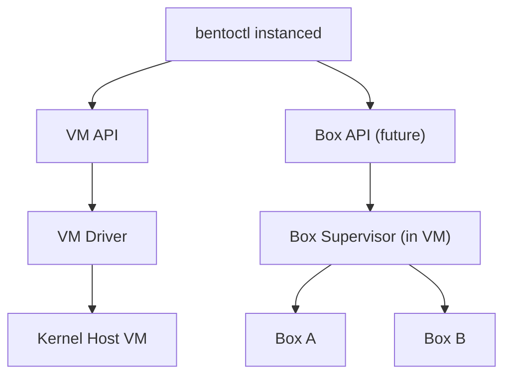
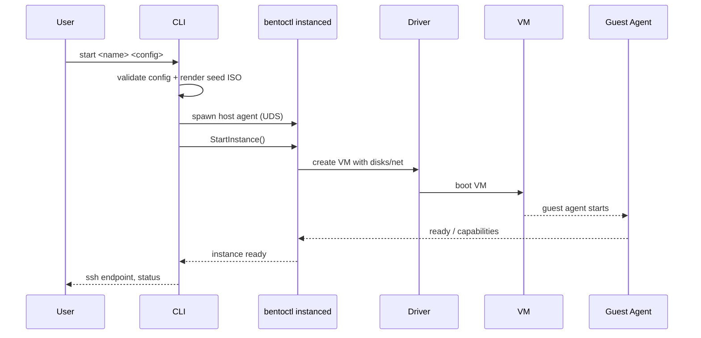
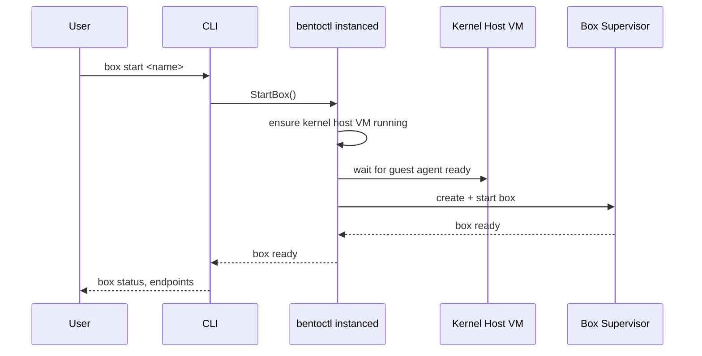
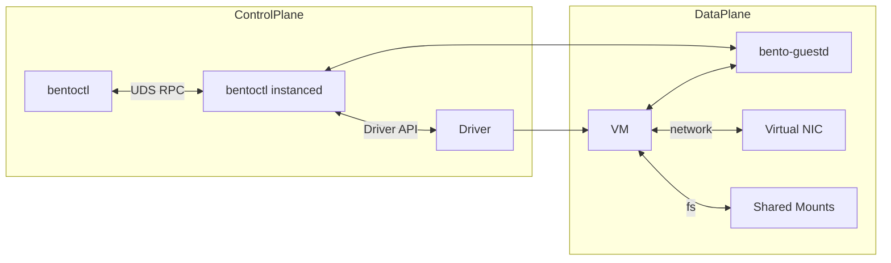
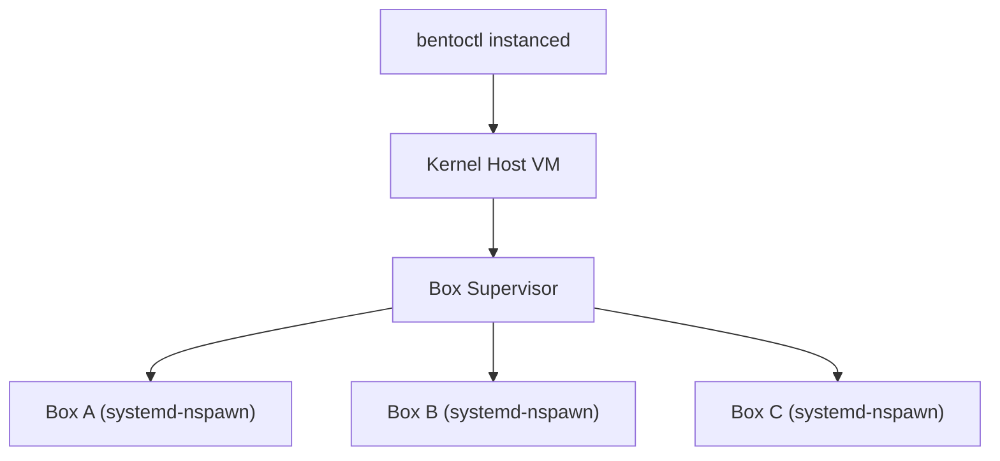

# Architecture

This document defines the initial architecture for Bentobox, a microVM and sandbox runtime that provides a simple interface to create, manage, and interact with secure sandboxes. The design targets macOS first while keeping a clean path to Linux and shared-kernel sandboxes later.

## Goals

- Provide full-VM semantics on macOS first (Linux guests, macOS guests when supported).
- Keep a driver abstraction that supports macOS Virtualization.framework now and Linux backends later.
- Use per-instance host agents for isolation and simple lifecycle management.
- Provide a stable control plane API over a Unix domain socket.
- Leave a clear path to a shared-kernel backend (systemd-nspawn or similar) without redesign.
- Make it easy to run untrusted code or isolate workloads with a consistent interface.

## Iteration plan

### Iteration 1 (VM API)

- Focus only on the VM API and full-VM semantics.
- Implement the driver abstraction and the macOS VZ driver.
- Ensure the VM layer exposes all the primitives required by a future box runtime.

### Iteration 2 (Box API)

- Add shared-kernel sandboxes on top of the VM layer.
- Implement a box supervisor inside the kernel host VM.
- Expose the box API from the host agent, backed by the box supervisor.

## Non-goals (initial)

- Global scheduler, multi-tenant quotas, or fleet orchestration.
- UI or long-running global daemon.
- Deep container tooling integration.

## High-level architecture

```mermaid
flowchart TB
  CLI["bentoctl"] -->|create/config| State["Instance State\n(XDG data dir)"]
  CLI -->|spawn subcommand| HA["bentoctl instanced"]
  CLI -->|RPC over UDS| HA

  HA -->|VM API| Driver["Driver Abstraction\n(VZ now, KVM/Firecracker later)"]
  Driver -->|macOS| VZ["Virtualization.framework"]
  Driver -->|Linux| FC["Firecracker/KVM (future)"]

  HA -->|guest comms| GA["bento-guestd (in VM)"]
  GA -->|vsock/virtio| HA
  GA -->|fallback| SSH["SSH Tunnel"]

  HA -->|Box API (future)| Box["Box Supervisor (in VM)"]
  Box -->|systemd-nspawn| Sandboxes["Shared-kernel Boxes (future)"]

  HA -->|mounts| FS["File Sharing"]
  HA -->|ports| PF["Port Forwarding"]
  HA -->|network| NET["Networking (SLiRP/VMNet)"]
```

## Core components

### CLI

- Creates and validates instance configuration.
- Renders provisioning artifacts (seed ISO, config files).
- Spawns the per-instance host agent.
- Talks to the host agent via UDS RPC for lifecycle actions.

### bentoctl instanced (per-instance service)

- Owns VM lifecycle: create, start, stop, pause, snapshot.
- Owns networking, port forwarding, and file sharing orchestration.
- Exposes a local API over a Unix domain socket.
- Writes logs and state into the instance directory.
- Hosts the future Box API (shared-kernel sandboxes) on top of the VM layer.

### Driver interface

- Abstracts the virtualization backend.
- Implementations are platform-specific and can be swapped by configuration.
- Initial driver: macOS Virtualization.framework (VZ) via `objc2`.
- Planned driver: Linux Firecracker/KVM (full VM semantics via microVM).
- Future drivers: QEMU for broader compatibility.

### Guest agent (bento-guestd)

- Minimal service inside the guest OS.
- Provides command execution, file ops, readiness, and health signals.
- Primary transport: vsock or virtio-serial, with SSH fallback.

### Provisioning

- Seed ISO with cloud-init (or equivalent) to configure the guest.
- Embedded guest agent and bootstrapping scripts.
- Deterministic idempotent setup for mounts, users, and networking.

## Layered architecture

Bentobox separates responsibilities into two layers so iteration 2 can build on iteration 1 without breaking the VM core.

- **VM layer**: provides full-VM primitives (create, start, stop, snapshot, guest comms). Backed by drivers.
- **Box layer (future)**: provides shared-kernel sandboxes, implemented by a box supervisor running inside a kernel host VM.



## Instance lifecycle



## Box lifecycle (future)

The Box API is hosted by the per-instance host agent and builds on the VM layer.



## Control plane vs data plane



## Guest protocol and extensions

The host and guest communicate over a single vsock connection with a multiplexed frame protocol. Services are registered dynamically by the host. Each service has its own protobuf schema and message IDs scoped to that service.

### Multiplexed frame protocol

All guest traffic uses a single vsock stream with fixed-size headers and protobuf payloads.

```text
FrameHeader (big-endian)
  u16 version
  u16 flags
  u32 service_id
  u32 message_id
  u64 request_id
  u32 payload_len
  [payload bytes]
```

Flags:

- `0x01` request
- `0x02` response
- `0x04` stream_start
- `0x08` stream_chunk
- `0x10` stream_end
- `0x20` error

### Service registration flow

Service IDs are allocated dynamically per connection by a registry service that always uses `service_id = 0`.

1. `bentoctl instanced` connects to `bento-guestd` over vsock.
2. Host sends a `RegistryHelloRequest` to confirm protocol compatibility.
3. Host sends `RegisterServiceRequest` with a JSON manifest for each extension it wants to enable.
4. Guest allocates a `service_id` and provisions the service.
5. Guest sends `ServiceReadyNotice` when the service is ready to receive messages.

### Service manifest (JSON)

When the host registers a service, it includes a JSON manifest that tells the guest how to provision and run the service.

```json
{
  "name": "boxd",
  "version": 1,
  "description": "Shared-kernel box supervisor service",
  "entrypoint": "/usr/local/bin/boxd",
  "artifacts": [
    {
      "kind": "binary",
      "path": "/usr/local/bin/boxd",
      "sha256": "b4c1a08a6d6e1d0f8e6f2a5e8f9a1b2c3d4e5f6a7b8c9d0e1f2a3b4c5d6e7f80"
    }
  ],
  "requires": {
    "guestd_protocol": 1,
    "kernel_features": ["cgroupv2", "ns_user", "ns_pid"]
  },
  "config": {
    "default_runtime": "systemd-nspawn",
    "state_dir": "/var/lib/bentobox/boxes"
  },
  "capabilities": [
    "box.create",
    "box.start",
    "box.stop",
    "box.exec"
  ]
}
```

## State and filesystem layout

Bentobox follows the XDG base directory spec.

- Config: `${XDG_CONFIG_HOME:-~/.config}/bentobox`
- Data: `${XDG_DATA_HOME:-~/.local/share}/bentobox`
- Cache: `${XDG_CACHE_HOME:-~/.cache}/bentobox`

Per instance, a single directory under the data dir owns all state and sockets.

```text
${XDG_DATA_HOME:-~/.local/share}/bentobox/instances/<instance>/
  config.yaml
  state.json
  logs/
  disks/
    base.img
    diff.img
    data.img
  seed/
    cidata.iso
  sockets/
    agent.sock
    ssh.sock
```

## Driver interface sketch

The driver is scoped to an instance directory. It reads and writes state on disk and does not require per-call arguments beyond its base path.

```text
trait Driver {
  fn new(instance_dir: PathBuf) -> Result<Self>;
  fn configure(&self, spec: InstanceSpec) -> Result<()>;
  fn create(&self) -> Result<()>;
  fn start(&self) -> Result<()>;
  fn stop(&self) -> Result<()>;
  fn pause(&self) -> Result<()>;
  fn resume(&self) -> Result<()>;
  fn snapshot(&self, name: &str) -> Result<()>;
  fn guest_comm(&self) -> Result<GuestChannel>;
}
```

### Instance directory contract

Drivers operate on a single instance directory as the source of truth. The minimum contract is:

```text
config.yaml        # InstanceSpec and derived config
state.json         # current state, timestamps, runtime metadata
pid                # pid file for the VM process (when running)
lock               # lock file indicating exclusive ownership
sockets/           # control sockets for UDS and guest comms
```

## Backend roadmap

### Full VM backend (initial)

- **macOS**: VZ driver (Virtualization.framework).
- **Linux**: Firecracker/KVM driver (microVM with full VM semantics).
- Optional later: QEMU driver for broader compatibility.

### Shared-kernel backend (future)

Goal: provide shared-kernel boxes on top of a single kernel host VM per user.



To support this without re-architecture:

- The VM layer remains unchanged and exposes a stable kernel host contract.
- The Box API is hosted by the same host agent, and uses guest comms to control the box supervisor.
- The driver API stays focused on VM primitives only.

## Networking, mounts, ports

- Networking is owned by the host agent and delegated to the driver.
- File sharing is host-driven (VirtioFS for VZ, vsock or 9p fallback later).
- Port forwarding is event-driven and managed per instance.

## Security model (initial)

- Per-instance host agents limit blast radius.
- UDS access is the primary control plane, no network exposure by default.
- Guest agent is minimal and only reachable via host-controlled channels.

## Project structure

All Rust crates live under `crates/`.

```text
crates/
  bento-runtime/        # domain types + VM API + drivers (cfg)
  bento-agent-proto/    # RPC types + versioning
  bento-util/           # XDG paths, logging, fs helpers
  bento-box/            # shared-kernel layer (future)
  bentoctl/             # CLI binary crate (includes instanced subcommand)
  bento-guestd/         # guest agent binary crate
```

- `bento-runtime` contains macOS VZ support via `objc2` and `objc2-virtualization` under `cfg(target_os = "macos")`.
- Linux backends live under `cfg(target_os = "linux")` in the same crate.

## Open questions

- Guest OS support matrix for macOS VZ (Linux and macOS guests).
- Firecracker kernel strategy and update channel on Linux.
- Shared-kernel isolation requirements and expected capabilities.
- Box supervisor implementation details and protocol.
